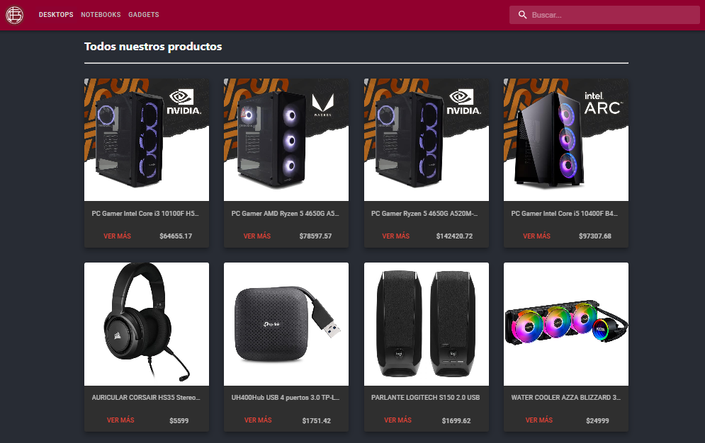

# Lanus Tech - Simple React Ecommerce Web App

### What to expect from this project?

- A main page where products, fetched from Firebase, are enlisted as cards.
- Each product has its own stock. Said stock gets updated in Firebase everytime a new purchase has been made.
- A detail view for every product.
- Functional search bar.
- Full checkout process including the dispatch and storage of the generated order to Firebase.
- Persistant cart using localStorage.
- Satisfactory user experience.

### Libraries/frameworks used in this project

| Name               | Purpose       |
| ------------------ | ------------- |
| React-router v6    | Navigation    |
| Material-ui v5.5.2 | Css framework |
| Animate.css v4     | Animations    |
| Firebase v9.6.10   | Database      |

### Demo

